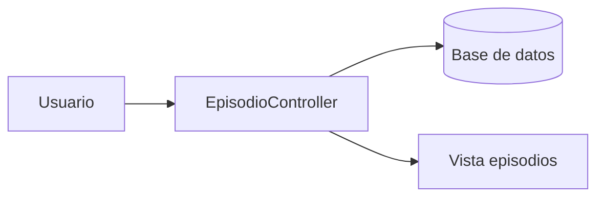

# Arquitectura y datos

## Capas y responsabilidades
- Controladores: orquestan peticiones web y preparan vistas.
- Servicios: encapsulan logica de negocio (estado actual, buscador).
- Modelos Eloquent: acceso a tablas de dominio y auth.
- Vistas Blade: UI server-side.
- Scheduler y comandos: refresco de cache y simulaciones.

Referencias:
- [../app/Http/Controllers/EpisodioController.php](../app/Http/Controllers/EpisodioController.php)
- [../app/Services/EstadoActualService.php](../app/Services/EstadoActualService.php)
- [../app/Services/BuscadorService.php](../app/Services/BuscadorService.php)

## Autenticacion y permisos
- Login personalizado contra la tabla auth_user.
- La sesion guarda `is_superuser` e `is_staff` y se valida en los controladores.
- Filament usa `User::canAccessPanel` y requiere `is_staff`.

Referencias:
- [../app/Http/Controllers/AuthController.php](../app/Http/Controllers/AuthController.php)
- [../app/Http/Controllers/Controller.php](../app/Http/Controllers/Controller.php)
- [../app/Models/User.php](../app/Models/User.php)

## Flujo: estado actual
```mermaid
flowchart LR
    U[Usuario] --> C[EpisodioController@inicio]
    C --> S[EstadoActualService]
    S --> DB[(Base de datos)]
    S --> API[API SAIH]
    S --> K[(Cache)]
    C --> V[Vista inicio]
```

Notas:
- Se cachea por CCAA y global.
- La sincronizacion periodica la hace el scheduler.

## Flujo: episodios


Incluye:
- Listados activos e historicos.
- Detalle con estaciones y mini graficos.

## Flujo: emergencias y PDF
```mermaid
flowchart LR
    U[Formulario] --> C[EmergenciaController@guardar]
    C --> Vld[Validacion]
    Vld -->|PDF adjunto| Storage[Disco publico]
    Vld -->|Texto correo| Pdf[Generacion PDF]
    Pdf --> Storage
    C --> DB[(situacion_emergencia)]
    C --> V[Vista plan o confirmacion]
```

## Flujo: graficos
```mermaid
flowchart LR
    U[Vista grafico] --> C[GraficoController@obtenerHistorial]
    C --> DB[(umbrales_randatosepisodio)]
    C --> R[JSON series]
    R --> UI[ApexCharts]
```

## Flujo: mapa global
```mermaid
flowchart LR
    U[Mapa global] --> C[EpisodioController@mapaGlobal]
    C --> K[(Cache)]
    C --> DB[(Coordenadas)]
    C --> V[Vista Leaflet]
    V --> G[GeoJSON de cuenca]
```

GeoJSON:
- [../public/geojson/CuencaTajoElegido.geojson](../public/geojson/CuencaTajoElegido.geojson)

## Cache y sincronizacion
Claves relevantes:
- `api_estado_actual_global`
- `api_estado_actual_ccaa_{id}`
- `api_estado_actual_sync_at`
- `api_estado_actual_modo`

Locks para concurrencia:
- `api:sync-datos:lock` en [../app/Console/Commands/SyncApiDatos.php](../app/Console/Commands/SyncApiDatos.php)
- `api:sync-datos:web` en [../app/Http/Controllers/EpisodioController.php](../app/Http/Controllers/EpisodioController.php)

TTL:
- Controlado por `ESTADO_ACTUAL_MAX_AGE_MIN` en [../app/Services/EstadoActualService.php](../app/Services/EstadoActualService.php)

## Integracion con API SAIH
- `API_SAIH_URL`: ultimo valor por tag.
- `API_SAIH_VALORES_URL`: valores en periodo (tendencia).
- Se prueban tags candidatos segun tipo de estacion.

Implementacion:
- [../app/Services/EstadoActualService.php](../app/Services/EstadoActualService.php)

## Busqueda global (resumen)
- Tipos: embalse, roea, marco, aforo, episodio.
- Filtros: alerta 1-3, activos/inactivos, episodios activos/historicos.
- Limite de tokens: 10.

Implementacion:
- [../app/Services/BuscadorService.php](../app/Services/BuscadorService.php)

## Resiliencia y manejo de errores
- Si la API no responde, se muestran valores como "Sin conexion".
- La tendencia puede devolver flechas de estado y mensajes de error.
- Los controladores evitan recalculo si el cache es valido.

## Modelo de datos (tablas clave)
- umbrales_umbralesran: estaciones tipo aforo, roea y marco de control.
- umbrales_embalsesran: embalses y umbrales.
- umbrales_ranepisodio: episodios (activos e historicos).
- umbrales_randatosepisodio: mediciones por episodio.
- umbrales_ranmaximosaforos: maximos historicos de aforo.
- umbrales_ccaa y umbrales_provincias: catalogos.
- situacion_emergencia: emergencias y PDFs.
- auth_user, auth_group, auth_permission, auth_user_groups: autenticacion.

Notas:
- re_estaciones_activas y re_estaciones_historicas guardan codigos en CSV.
- Se usan consultas con `ILIKE` y `DATE_TRUNC`, por lo que PostgreSQL es el motor esperado.

## Eventos y tiempo real
- Evento: [../app/Events/NuevoCambioRecibido.php](../app/Events/NuevoCambioRecibido.php)
- Canal: panel-alertas.
- Listener en layout: [../resources/views/auth/plantilla.blade.php](../resources/views/auth/plantilla.blade.php)

## Modelos y generacion
Los modelos viven en la carpeta app. Muchos estan generados con Reliese; ver [../config/models.php](../config/models.php).

## Ver tambien
- [Indice](README.md)
- [Funcionalidades y rutas](04-funcionalidades-rutas.md)
- [Operacion y mantenimiento](06-operacion-mantenimiento.md)
